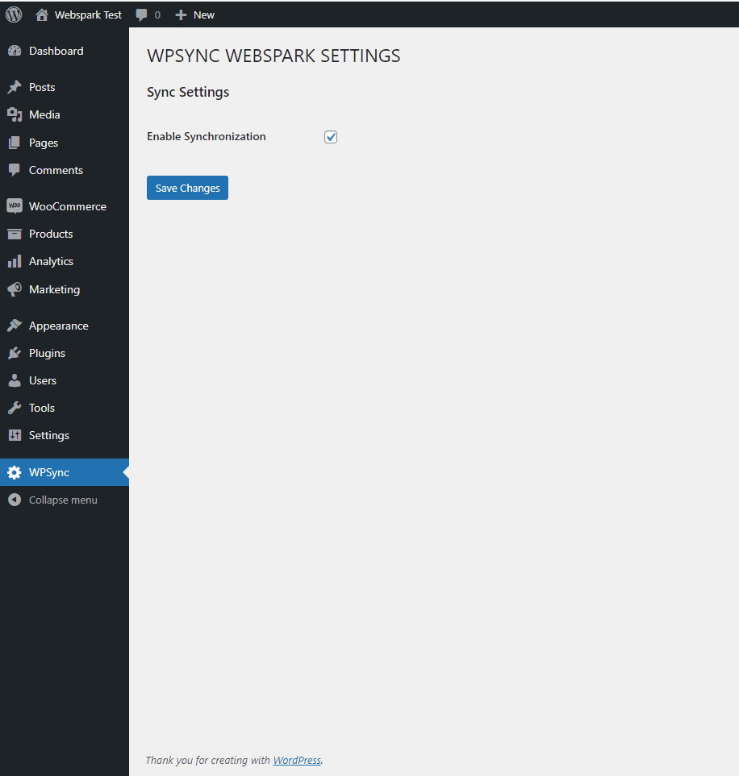

# Websync Plugin

Test assignment for `Webspark`

## Description

This plugin sync products with `Test Webspark API`. It's creates new products and update existing products data with API data.

## Installation

Download `zip` from `https://github.com/molefirenko/wpsync-webspark`.

In wordpress dashboard open `Plugins`, `Add new`, `Upload Plugin` and choose downloaded file and Activate plugin.

## Use

After activation in dashboard `WPSync` menu will appear.

To enable syncronization `Enable Syncronization` checkbox must be checked.

Main cron event `wpsync_cron_action` will fire every hour. This event gets all products from API. To force this process `WP Crontrol` plugin can be used.
Secondary cron event `wpsync_create_products_queue` fire every minute. This event added products splited by 35 items.
